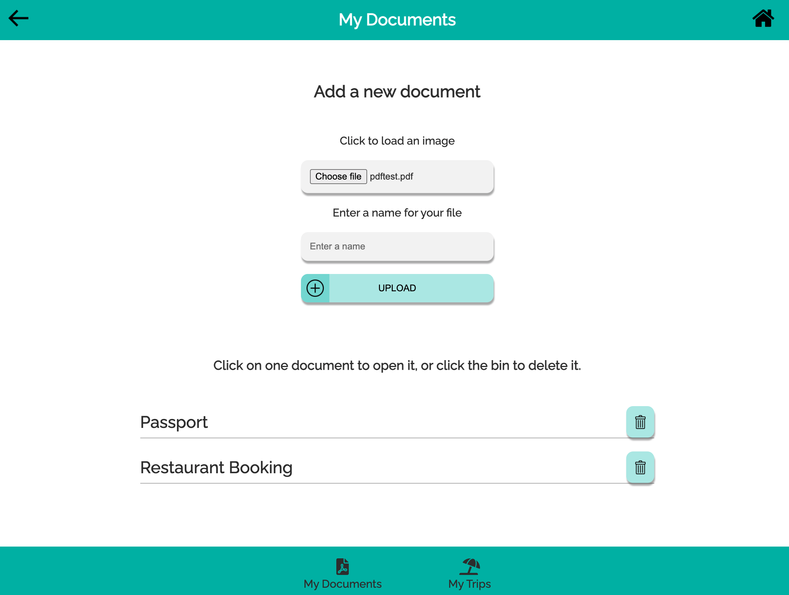
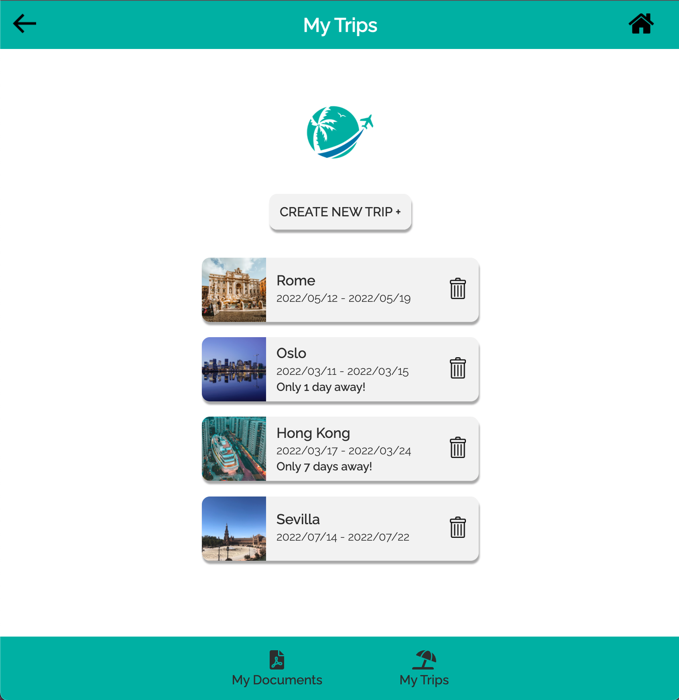
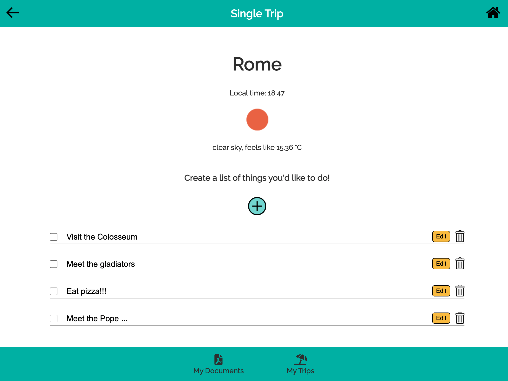

# Trip Planner

Trip Planner is a travel app to keep your trips tidy! Upload your travel documents, schedule your trips and make plans for each trip!

## Local Install

- Clone repo https://github.com/fac-23/trip-planner
- Run `npm install` in your terminal
- Run `npm run dev` in your terminal to start local server

## Roles

* QA - [Milly](https://github.com/millipede-cpu)
* DevOps - [Orian](https://github.com/OrianP)
* Scrum Facilitator & UX/UI - [Paolo](https://github.com/paologhidoni)

## Preview
Add a new travel document

View all your upcoming trips

Make a list of things to do on your trip

